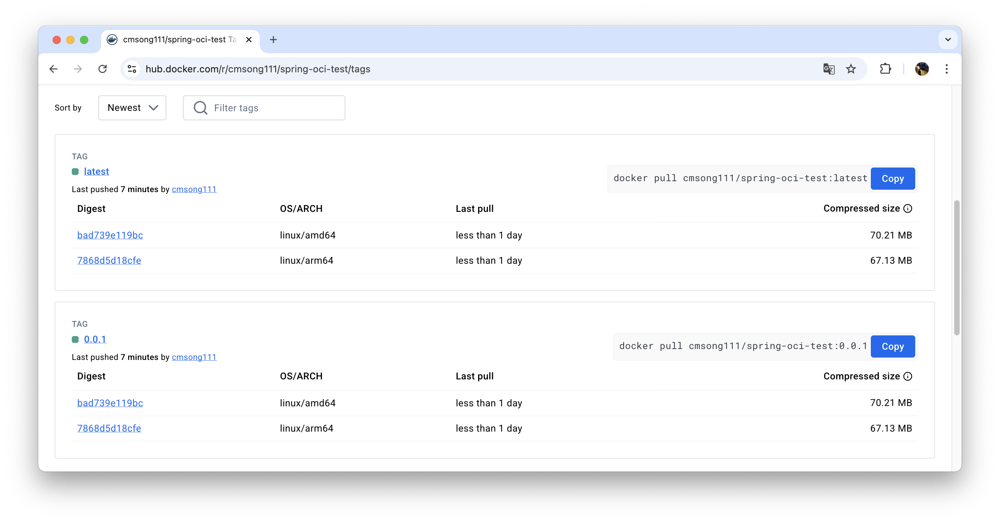
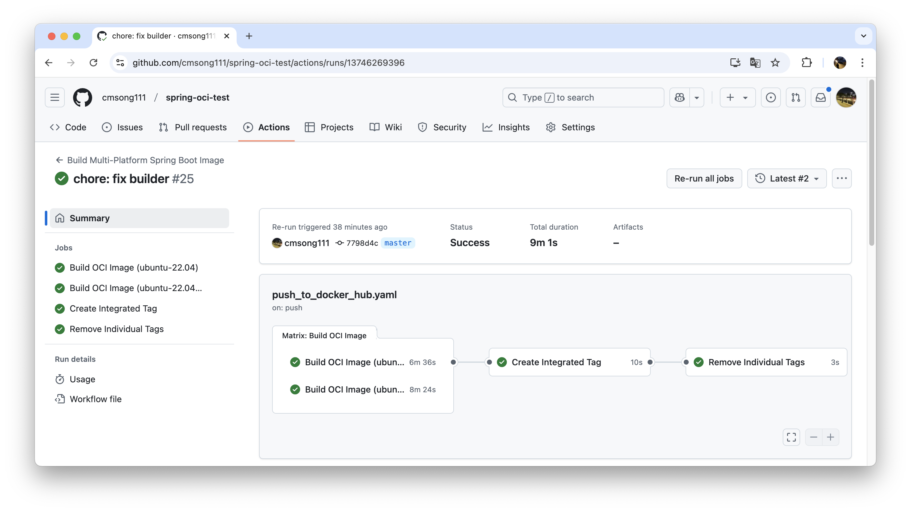

# 스프링부트 Cloud Native BuildPack를 활용한 멀티플랫폼 이미지 생성 테스트

> DockerFile 없이 스프링부트 Cloud Native BuildPack를 활용하여 멀티플랫폼 이미지를 생성하는 테스트 프로젝트입니다.

## 개요

- **GitHub Actions의 ARM64 지원**: GitHub Actions에서 최근 ARM64 기반 Linux 호스트 러너를 Preview로 제공하기 시작했습니다. 
  [관련 링크](https://github.blog/changelog/2025-01-16-linux-arm64-hosted-runners-now-available-for-free-in-public-repositories-public-preview/)
- **Spring Native Build**: Cloud Native BuildPack은 `linux/amd64`, `linux/arm64`, `linux/arm/v5`등 여러 플랫폼으로의 빌드를 지원합니다.<br>
  이를 활용면 멀티플랫폼 이미지를 생성할 수 있습니다

#### -> 그럼 Spring Native Build도 멀티플랫폼 이미지를 생성할 수 있지 않을까?

## 결과

- Docker Hub에서 latest 및 특정 버전의 이미지를 pull하면, 각 플랫폼에 맞는 이미지가 반환됩니다.
- 해당 이미지는 ARM64 및 x86 아키텍처를 지원하며, 각 플랫폼에 맞는 이미지를 선택할 수 있습니다.



## 깃허브 액션

GitHub Actions의 매트릭스 전략을 통해 서로 다른 플랫폼(ubuntu-22.04, ubuntu-22.04-arm)에서 이미지를 빌드하고, 이를 하나의 태그에 등록하는 과정을 자동화합니다.



### 이미지 빌드 (매트릭스 빌드)

각 플랫폼에서 빌드가 자동으로 진행되도록 설정되었습니다. 이를 통해 멀티플랫폼 이미지를 각기 다른 아키텍처에 대해 빌드하고, Docker Hub에 푸시합니다.

1. ubuntu-22.04와 ubuntu-22.04-arm을 매트릭스로 설정하여, 각각 x86_64와 ARM64 아키텍처에서 빌드가 진행됩니다.
2. Gradle의 bootBuildImage 명령어로 이미지를 생성합니다.

```yaml
jobs:
  build-oci-image:
    name: Build OCI Image
    strategy:
      matrix:
        os: [ ubuntu-22.04, ubuntu-22.04-arm ]

    runs-on: ${{ matrix.os }}

    steps:
      - uses: actions/checkout@v4
      - name: Set up JDK 21
        uses: actions/setup-java@v4
        with:
          java-version: '21'
          distribution: 'temurin'

      - name: Setup Gradle
        uses: gradle/actions/setup-gradle@v3

      - name: Permissions for Gradle wrapper
        run: chmod +x gradlew

      - name: Get the version
        run: echo "VERSION=$(./gradlew properties -q | grep '^version:' | awk '{print $2}')" >> $GITHUB_ENV

      - name: Set OCI Image Name
        run: echo "IMAGE_NAME=${{ vars.DOCKERHUB_USERNAME }}/spring-oci-test:${{ env.VERSION }}-${{ matrix.os }}" >> $GITHUB_ENV

      - name: Build Boot Image with Buildpacks
        run: |
          ./gradlew bootBuildImage --imageName ${{ env.IMAGE_NAME }}

      - name: Login to DockerHub
        uses: docker/login-action@v3
        with:
          username: ${{ vars.DOCKERHUB_USERNAME }}
          password: ${{ secrets.DOCKERHUB_TOKEN }}

      - name: Push Individual Images
        run: |
          docker push ${{ env.IMAGE_NAME }}

    outputs:
      version: ${{ env.VERSION }}
```

### Manifest 생성으로 멀티플랫폼 이미지 생성

각기 다른 아키텍처에서 빌드된 이미지를 Manifest를 설정하여 하나의 태그에 등록합니다.

이를 통해 latest 또는 버전 태그를 통해 여러 플랫폼을 지원하는 이미지를 받을 수 있습니다.

```yaml
jobs:
  create-integrated-tag:
    name: Create Integrated Tag
    needs: build-oci-image
    runs-on: ubuntu-latest

    steps:
      - name: Login to DockerHub
        uses: docker/login-action@v3
        with:
          username: ${{ vars.DOCKERHUB_USERNAME }}
          password: ${{ secrets.DOCKERHUB_TOKEN }}

      - name: Create Multi-Platform Image
        run: |
          docker manifest create ${{ vars.DOCKERHUB_USERNAME }}/spring-oci-test:${{ needs.build-oci-image.outputs.version }} \
            ${{ vars.DOCKERHUB_USERNAME }}/spring-oci-test:${{ needs.build-oci-image.outputs.version }}-ubuntu-22.04 \
            ${{ vars.DOCKERHUB_USERNAME }}/spring-oci-test:${{ needs.build-oci-image.outputs.version }}-ubuntu-22.04-arm

          docker manifest push ${{ vars.DOCKERHUB_USERNAME }}/spring-oci-test:${{ needs.build-oci-image.outputs.version }}

          docker manifest create ${{ vars.DOCKERHUB_USERNAME }}/spring-oci-test:latest \
            ${{ vars.DOCKERHUB_USERNAME }}/spring-oci-test:${{ needs.build-oci-image.outputs.version }}-ubuntu-22.04 \
            ${{ vars.DOCKERHUB_USERNAME }}/spring-oci-test:${{ needs.build-oci-image.outputs.version }}-ubuntu-22.04-arm

          docker manifest push ${{ vars.DOCKERHUB_USERNAME }}/spring-oci-test:latest
```

### 기존 별개의 이미지 제거(선택)

빌드된 이미지가 푸시된 후, 각 플랫폼별로 생성된 이미지를 Docker Hub에서 삭제하여 관리를 용이하게 합니다.

이 과정은 선택적으로 수행됩니다.

```yaml
jobs:
  remove-individual-tags:
    name: Remove Individual Tags
    needs:
      - build-oci-image
      - create-integrated-tag
    runs-on: ubuntu-latest

    steps:
      - name: Remove Individual Tags
        run: |
          curl -X DELETE \
            -H "Authorization: Bearer ${{ secrets.DOCKERHUB_TOKEN }}" \
            https://hub.docker.com/v2/repositories/${{ vars.DOCKERHUB_USERNAME }}/spring-oci-test/tags/${{ needs.build-oci-image.outputs.version }}-ubuntu-22.04/

          curl -X DELETE \
            -H "Authorization: Bearer ${{ secrets.DOCKERHUB_TOKEN }}" \
            https://hub.docker.com/v2/repositories/${{ vars.DOCKERHUB_USERNAME }}/spring-oci-test/tags/${{ needs.build-oci-image.outputs.version }}-ubuntu-22.04-arm/

```
